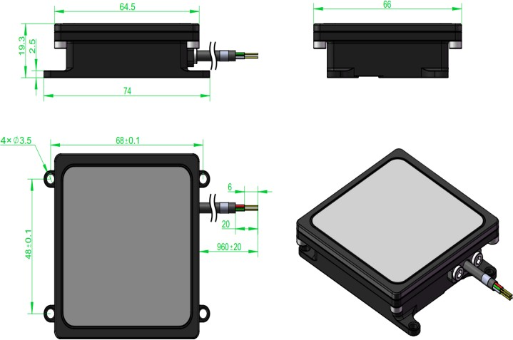
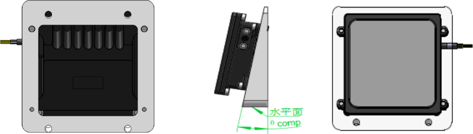
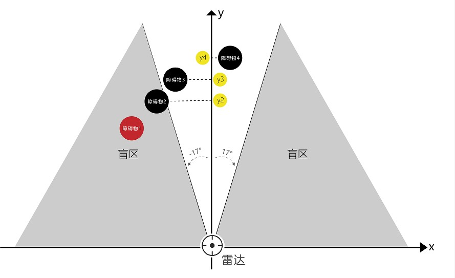

# RDS02U（UART）型无人机单目标避障雷达应用手册

## RDS02U 简介

RDS02U型避障雷达是一款轻巧的毫米波避障雷达传感器，测量精度高、体型小巧、灵敏度高、重量轻、易于集成、性能稳定。该产品通过向前方发射扇形的 77GHz 电磁波并处理回波信号，判断前方是否有障碍物，反馈障碍物与雷达的相对距离、速度、方位角等信息，引导无人机等雷达载体避开障碍物，确保其安全工作。

RDS02U 型中距雷达具有以下特性：

-   收发天线采用 2 发 4 收 MIMO 阵列，方位视场范围 34 度，角度分辨和测角精度高；
-   工作频率为 77GHz\~81GHz，具有动目标敏感、距离测量精度高的优点；
-   有效探测距离 27m；
-   支持 UART 协议输出，默认波特率 115200；
-   信号处理和控制单元采用单片 DSP+ARM 双核心架构，在内部高速数字信号处理器上运行雷达数据处理、目标检测和目标跟踪等算法。

## 产品特征



## 产品参数

| **特 性**            | **参 数**                   | **技术指标**            |
|----------------------|-----------------------------|-------------------------|
|    **天线性能**      | 水平束波宽度                | ±17°                    |
|                      | 垂直波束宽度                | ±3°                     |
|                      | 最大 EIRP(dBm)              | 30                      |
|    **雷达性能**      | 测距范围(m)                 | 1.5\~27                 |
|                      | 测距精度(m)                 | 优于 0.1                |
|                      | 距离分辨率(m)               | 0.18                    |
|    **雷达属性**      | 发射频率(GHz)               | 77\~81                  |
|                      | 刷新率(Hz)                  | 20                      |
|                      | 调频带宽(GHz)               | 1.5                     |
|    **系统属性**       | 工作电压(V)                 | 8-24                    |
|                      | 工作温度                    | -40℃\~65℃               |
|                      | 功耗(W)                     | 2                       |
|                      | 防水等级                    | IP67                    |
|                      | 数据接口                    | UART                    |
|                      | PCB 尺寸（长、宽、高）(mm)  | 50\*50\*7.8             |
|   **外观参数**       | 尺寸                        | 74×66×19.3mm            |
|                      | 重量                        | 约 109.5g（包括连接线） |

## 引脚定义

RDS02U 传感器的接口引脚定义，如下表所示：

| **引脚** | **线束标识** | **线束颜色** | **线束定义** |
|----------|--------------|--------------|--------------|
| **1**    | VCC          | 红色         | 电源正极     |
| **2**    | GND          | 黑色         | 电源负极     |
| **3**    | TX_CAN_H     | 绿色         | TX           |
| **4**    | RX_CAN_L     | 白色         | RX           |

## 安装方法

**RDS02U** 型雷达安装步骤如下：

-   安装位置：雷达水平波束±17°、垂直波束±3°波束范围内不能有任何遮挡物；
-   安装方向：雷达收发天线位于雷达背面箭头处，安装时雷达后面箭头方向朝上，雷达正面朝无人机飞行方向；
-   安装角度：雷达安装时天线面（雷达正面）指向无人机正前方，根据无人机飞行姿态向下的最大倾角，雷达向上倾斜安装,最佳安装倾角与飞机飞行过程中的最大倾角与离地高度有关，一般安装倾角为 12°；



## 快速使用指南

RDS02U 传感器直接输出最近障碍物的 Y 坐标，如下图所示，障碍物 1 不在雷达波束范围内，雷达探测不到，障碍物 2、3、4 中，障碍物 2 离雷达的距离Y2 最近，雷达最终输出的值为 Y2。

串口波特率115200，仅支持3.3V电平，数据刷新率20Hz，数据单位厘米（cm），按客户需求发送指定的数据包格式，每一帧的数据包按客户的协议执行。RDS02U的消息定义如下表 3 RDS02U 雷达帧消息定义。

| 功能       | 代码  | 字节数 |
|------------|-------|--------|
| 帧起始符   | 5555H | 2      |
| 地址码     | ADD   | 1      |
| 错误码     | ERR   | 1      |
| 功能码     | FC    | 2      |
| 数据域长度 | L     | 2      |
| 数据域     | DATA  | N      |
| 校验码     | CRC   | 1      |
| 帧结束符   | AAAAH | 2      |

帧是传送数据的基本单元，如表2所示。数据传输顺序为小端传输，先传送低字节，再传送高字节，具体可见协议手册。

**雷达目标信息**
| 输出内容  | 雷达目标信息  |
|------------|-------|
| 完整帧    | 55 55 01 00 FF 03 0A 00 DATA CRC AA AAH |
| 功能码 | 03FFH |
| DATA内容说明 | DATA[0]~DATA[1] :数据功能码；功能码为0x70C + 雷达 ID * 0x10 |
|               | DATA[2] :目标ID；目标只支持单目标，固定输出为0x01 |
|               | DATA[3]~DATA[4] :目标X坐标（ValueX_L、ValueX_H） |
|               | DATA[5]~DATA[6] :目标Y坐标（ValueY_L、ValueY_H） |
|               | DATA[7]~DATA[9] :保留，默认输出0|

>Note:
表中目标的X、Y坐标并非目标坐标的真实值，真实数值需要经过如下公式计算获得,雷达输出的目标坐标数据单位为 cm： 
X = (ValueX_H*256 + ValueX_L) - 32768 (cm)
Y = ValueY_H*256 + ValueY_L (cm)

**雷达目标信息解析示例：**

以雷达ID为0时目标信息为例，有一帧目标信息数据如下：
- 完整帧数据：55 55 01 00 FF 03 0A 00 0C 07 01 23 80 F8 00 00 00 00 CRC AAAA
- DATA：0C 07 01 23 80 F8 00 00 00 00
- 数据功能码：0x70C
- 目标ID：ID = 0x01
- 目标X坐标：X = (0x80*256)+0x23）- 32768 = 35cm
- 目标Y坐标：Y = (0x00*256)+0xF8 = 248 cm

CRC8校验函数
```c
uint8_t crc8(uint8_t* pbuf, int32_t len)
{
     uint8_t* data = pbuf;
     uint8_t crc = 0;
     while ( len-- )
     crc = crc8_table[crc^*(data++)];
     return crc;
}
```
CRC8码表
```c
uint8_t crc8_table[256] = {
0x93,0x98,0xE4,0x46,0xEB,0xBA,0x04,0x4C,
0xFA,0x40,0xB8,0x96,0x0E,0xB2,0xB7,0xC0,
0x0C,0x32,0x9B,0x80,0xFF,0x30,0x7F,0x9D,
0xB3,0x81,0x58,0xE7,0xF1,0x19,0x7E,0xB6,
0xCD,0xF7,0xB4,0xCB,0xBC,0x5C,0xD6,0x09,
0x20,0x0A,0xE0,0x37,0x51,0x67,0x24,0x95,
0xE1,0x62,0xF8,0x5E,0x38,0x15,0x54,0x77,
0x63,0x57,0x6D,0xE9,0x89,0x76,0xBE,0x41,
0x5D,0xF9,0xB1,0x4D,0x6C,0x53,0x9C,0xA2,
0x23,0xC4,0x8E,0xC8,0x05,0x42,0x61,0x71,
0xC5,0x00,0x18,0x6F,0x5F,0xFB,0x7B,0x11,
0x65,0x2D,0x8C,0xED,0x14,0xAB,0x88,0xD5,
0xD9,0xC2,0x36,0x34,0x7C,0x5B,0x3C,0xF6,
0x48,0x0B,0xEE,0x02,0x83,0x79,0x17,0xE6,
0xA8,0x78,0xF5,0xD3,0x4E,0x50,0x52,0x91,
0xD8,0xC6,0x22,0xEC,0x3B,0xE5,0x3F,0x86,
0x06,0xCF,0x2B,0x2F,0x3D,0x59,0x1C,0x87,
0xEF,0x4F,0x10,0xD2,0x7D,0xDA,0x72,0xA0,
0x9F,0xDE,0x6B,0x75,0x56,0xBD,0xC7,0xC1,
0x70,0x1D,0x25,0x92,0xA5,0x31,0xE2,0xD7,
0xD0,0x9A,0xAF,0xA9,0xC9,0x97,0x08,0x33,
0x5A,0x99,0xC3,0x16,0x84,0x82,0x8A,0xF3,
0x4A,0xCE,0xDB,0x29,0x0F,0xAE,0x6E,0xE3,
0x8B,0x07,0x3A,0x74,0x47,0xB0,0xBB,0xB5,
0x7A,0xAA,0x2C,0xD4,0x03,0x3E,0x1A,0xA7,
0x27,0x64,0x06,0xBF,0x55,0x73,0x1E,0xFE,
0x49,0x01,0x39,0x28,0xF4,0x26,0xDF,0xDD,
0x44,0x0D,0x21,0xF2,0x85,0xB9,0xEA,0x4B,
0xDC,0x6A,0xCA,0xAC,0x12,0xFC,0x2E,0x2A,
0xA3,0xF0,0x66,0xE8,0x60,0x45,0xA1,0x8D,
0x68,0x35,0xFD,0x8F,0x9E,0x1F,0x13,0xD1,
0xAD,0x69,0xCC,0xA4,0x94,0x90,0x1B,0x43,
};
```

## 产品使用注意事项

- 雷达在运输、存储、工作和拿取的过程中需要充分做好静电防护工作，如出现雷达探测覆盖范围内无目标物体时，雷达持续输出无规律目标或者当电源电压及源电流等 DC 参数值处于正常范围时，无法得到输出信号的情况，雷达可能已经损坏。
- 安装时请保持雷达罩面干净，清理罩面需要用柔软的湿布擦拭，然后自然风干；
- 安装时请注意雷达形状，确保安装的雷达未变形，切勿挤压，磕碰，摔打；
- 安装时确保雷达为出厂件，切勿自行进行拆装；

## 常见问题（FAQ）

1. 雷达探测范围为多少？为什么最小探测距离为 1.5m？
    无人机避障探测范围为 1.5-27m，考虑机翼的长度问题，需要在无人机离障碍物距离\>1.5m 时停下，故最小探测距离为 1.5m。

2. 最佳安装角度不会算，有没有安装的参考角度？
    根据上述安装角度建议及我司的测试效果，建议一般飞控向上倾斜 12°安装。

3. 雷达没有探测到障碍物时有没有数据输出？
    雷达实时输出数据，当雷达没探测到障碍物或障碍物距离大于 30m 时，输出数据为 0，当雷达探测到障碍物时，输出为障碍物的实际距离。

    若在安装过程中遇到无法解决的问题，请联系北醒（北京）光子科技有限公司客服人员，我们将竭诚为您服务！
