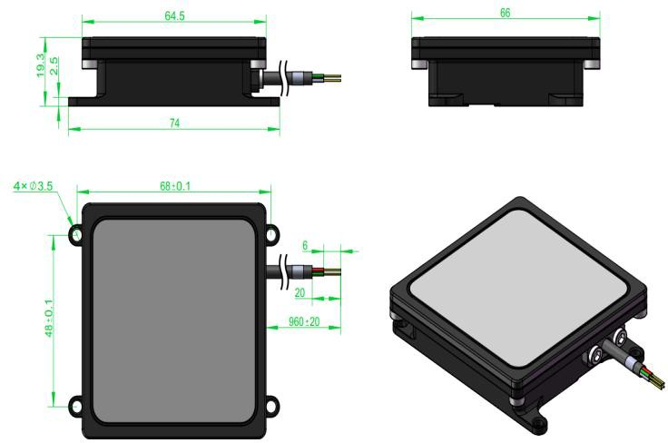
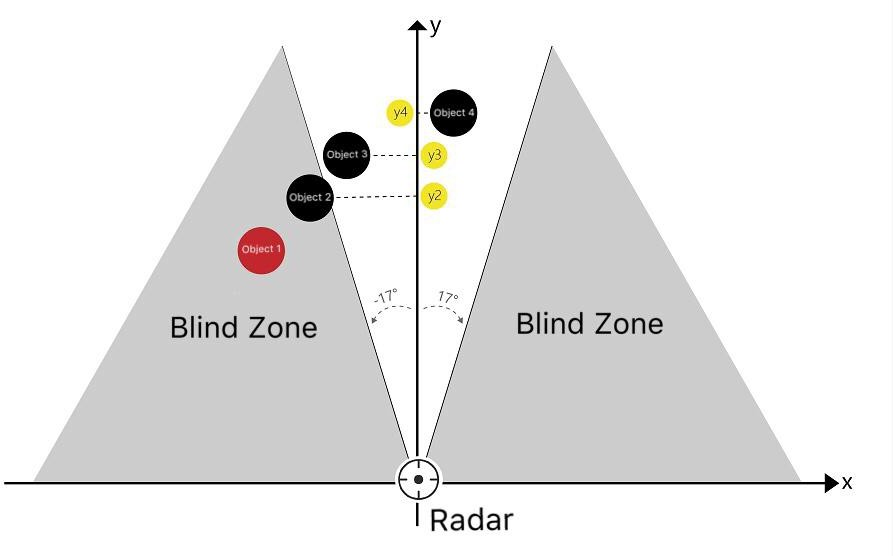

# Introduction

RDS02U is a lightweight millimeter-wave radar sensor. This product actively transmits a 77GHz electromagnetic wave to the front direction and processes the echo signal to determine whether there is an obstacle in front and feedback the obstacle range, speed, azimuth and other information from the radar guide radar carriers such as drones to avoid obstacles autonomously to ensure their safe operation.

# Highlights:

1. The transmitter and receiver antennas use 2 transmitter and 4 receiver MIMO arrays, the azimuth field range is 34 degrees, and the Angle resolution and Angle measurement accuracy are high.
2.  The operating frequency is 77GHz\~81GHz, which has the advantages of moving target sensitivity and high range measurement accuracy.
3.  Effective detection range is 27m;
4.  Supports output over the UART protocol, with a default baud rate of 115200.
5.  The signal processing and control unit uses a monolithic DSP +ARM dual-core architecture to run algorithms such as radar data processing, target detection and target tracking on an internal high-speed digital signal processor.

# Performance Parameters

Table 1 Performance Parameters

| **Item**                  | **Parameter Name**         | **Performance** **Specification** |
|---------------------------|----------------------------|-----------------------------------|
|   **Antenna performance** | Horizontal beam width      | ±17°                              |
|                           | Vertical beam width        | ±3°                               |
|                           | EIRP(dBm)                  | 30                                |
|   **Radar performance**   | Range Scope(m)             | 1.5\~27                           |
|                           | Range Accuracy(m)          | \<0.1                             |
|                           | Range Resolution(m)        | 0.12                              |
|                           | Frequency Band(GHz)        | 77 - 81                           |
| **Radar properties**      | Frame Rate(Hz)             | 20                                |
|                           | Modulation Bandwidth (GHz) | 1.5                               |
|                           | Working Voltage(V)         | 8 - 24                            |
|    **System properties**  | Temperature(°C)            | -40 - 85                          |
|                           | Power(W)                   | 2                                 |
|                           | Waterproof Level           | IP67                              |
|                           | Interface                  | UART                              |
|                           | Dimension(mm)              | 50\*50\*7.8                       |

# Product Physical Drawing



Figure 1 RDS02U Physical Image

# Installation Method

RDS02U radar installation steps:

-   Installation location: Radar horizontal beam ±17°, vertical beam ±3° beam range shall not have any occlusion.
-   Installation direction: The radar transceiver antenna is located at the arrow on the back of the radar. During installation, the arrow on the back of the radar is up and the radar is facing the UAV.
-   Installation Angle: When the radar is installed, the antenna surface (the front of the radar) points directly in front of the UAV. According to the maximum downward inclination Angle of the UAV's flying attitude, the radar is installed by tilting upward. The optimal installation Angle is the same as the aircraft flying.

# Quick Use Steps

### Pin Definition

Interface pin definitions for RDS02U sensors, as shown in Table 2:

Table 2 RDS02U Pin Interface Definition

| **Pin** | **Wiring harness identification** | **Wiring harness color** | **Definition**|
|---------|-----------------------------------|--------------------------|-----|
| 1       | VCC                               | red                      | positive pole|
| 2       | GND                               | black                    |  negative pole|
| 3       | TX_CAN_H                          | green                    | TX|
| 4       | RX_CAN_L                          | white                    | RX|

### Data Analysis

The RDS02U sensor directly outputs the Y coordinate of the nearest obstacle, as shown in the figure below. Obstacle 1 is not within the range of the radar beam and cannot be detected by the radar. In obstacle 2, 3 and 4, obstacle 2 is closest to the radar Y2, and the final output value of the radar is Y2.

Figure 3 Blind Zone and Object Detected

The serial port has a baud rate of 115200, supports only 3.3V level, data refresh rate of 20Hz, and data unit (cm). The serial port sends data packets in the specified format as required by the customer, and each packet is executed according to the customer's protocol.

RDS02U message definitions are shown in the table below:

Table 3 RDS02U Radar Frame Message Definition
| Define       | Code  | Bytes |
|--------------|-------|-------|
| Frame Head   | 5555H | 2     |
| Address code | ADD   | 1     |
| Error code    | ERR   | 1     |
| Function code | FC    | 2     |
| Length        | L     | 2     |
| Data          | DATA  | N     |
| Check code    | CRC   | 1     |
| End of Frame  | AAAAH | 2     |

Frame is the basic unit for transmitting data, as shown in Table 3. The sequence of data transmission is small endian. The low byte is transmitted first, and then the high byte is transmitted.

**Targer Information**
| content | target information |
| ------------ | ------------ |
| Full Frame    | 55 55 01 00 FF 03 0A 00 DATA CRC AA AAH |
| Function Code | 03FFH |
| DATA Describe | DATA[0]~DATA[1] :Data function code;the function code is 0x70C + radar ID * 0x10 |
|               | DATA[2] :Target ID; the target only supports single target, and the fixed output is 0x01 |
|               | DATA[3]~DATA[4] :Target X coordinates (ValueX_L, ValueX_H) |
|               | DATA[5]~DATA[6] :Target Y coordinates (ValueY_L, ValueY_H) |
|               | DATA[7]~DATA[9] :Reserved, the default output is 0|

> Note:
The X and Y coordinates of the target in the table are not the real values ​​of the target coordinates. The real values ​​need to be calculated by the following formula. The unit of the target coordinate data output by the radar is cm.
X = (ValueX_H*256 + ValueX_L) - 32768 (cm)
Y = ValueY_H*256 + ValueY_L (cm)

**Example of radar target information analysis:**

Taking the target information when the radar ID is 0 as an example, there is a frame of target information data as follows:
- Full frame data:55 55 01 00 FF 03 0A 00 0C 07 01 23 80 F8 00 00 00 00 CRC AAAA
- DATA：0C 07 01 23 80 F8 00 00 00 00
- Function Code: 0x70C
- Target ID：ID = 0x01
- Target X coordinates: (0x80*256)+0x23）- 32768 = cm
- Target Y coordinates:(0x00*256)+0xF8 = 248cm

CRC8 function
```c
uint8_t crc8(uint8_t* pbuf, int32_t len)
{
     uint8_t* data = pbuf;
     uint8_t crc = 0;
     while ( len-- )
     crc = crc8_table[crc^*(data++)];
     return crc;
}
```

CRC8 table
```c
uint8_t crc8_table[256] = {
0x93,0x98,0xE4,0x46,0xEB,0xBA,0x04,0x4C,
0xFA,0x40,0xB8,0x96,0x0E,0xB2,0xB7,0xC0,
0x0C,0x32,0x9B,0x80,0xFF,0x30,0x7F,0x9D,
0xB3,0x81,0x58,0xE7,0xF1,0x19,0x7E,0xB6,
0xCD,0xF7,0xB4,0xCB,0xBC,0x5C,0xD6,0x09,
0x20,0x0A,0xE0,0x37,0x51,0x67,0x24,0x95,
0xE1,0x62,0xF8,0x5E,0x38,0x15,0x54,0x77,
0x63,0x57,0x6D,0xE9,0x89,0x76,0xBE,0x41,
0x5D,0xF9,0xB1,0x4D,0x6C,0x53,0x9C,0xA2,
0x23,0xC4,0x8E,0xC8,0x05,0x42,0x61,0x71,
0xC5,0x00,0x18,0x6F,0x5F,0xFB,0x7B,0x11,
0x65,0x2D,0x8C,0xED,0x14,0xAB,0x88,0xD5,
0xD9,0xC2,0x36,0x34,0x7C,0x5B,0x3C,0xF6,
0x48,0x0B,0xEE,0x02,0x83,0x79,0x17,0xE6,
0xA8,0x78,0xF5,0xD3,0x4E,0x50,0x52,0x91,
0xD8,0xC6,0x22,0xEC,0x3B,0xE5,0x3F,0x86,
0x06,0xCF,0x2B,0x2F,0x3D,0x59,0x1C,0x87,
0xEF,0x4F,0x10,0xD2,0x7D,0xDA,0x72,0xA0,
0x9F,0xDE,0x6B,0x75,0x56,0xBD,0xC7,0xC1,
0x70,0x1D,0x25,0x92,0xA5,0x31,0xE2,0xD7,
0xD0,0x9A,0xAF,0xA9,0xC9,0x97,0x08,0x33,
0x5A,0x99,0xC3,0x16,0x84,0x82,0x8A,0xF3,
0x4A,0xCE,0xDB,0x29,0x0F,0xAE,0x6E,0xE3,
0x8B,0x07,0x3A,0x74,0x47,0xB0,0xBB,0xB5,
0x7A,0xAA,0x2C,0xD4,0x03,0x3E,0x1A,0xA7,
0x27,0x64,0x06,0xBF,0x55,0x73,0x1E,0xFE,
0x49,0x01,0x39,0x28,0xF4,0x26,0xDF,0xDD,
0x44,0x0D,0x21,0xF2,0x85,0xB9,0xEA,0x4B,
0xDC,0x6A,0xCA,0xAC,0x12,0xFC,0x2E,0x2A,
0xA3,0xF0,0x66,0xE8,0x60,0x45,0xA1,0x8D,
0x68,0x35,0xFD,0x8F,0x9E,0x1F,0x13,0xD1,
0xAD,0x69,0xCC,0xA4,0x94,0x90,0x1B,0x43,
};
```

# Precautions For Product Use

- During the transportation, storage, working and taking of the radar, it is necessary to fully protect the static electricity. For example, when there is no target object within the radar detection coverage, the radar continuously outputs irregular targets or when the DC voltage values such as power supply voltage and source current When it is in the normal range, the output signal cannot be obtained, and the radar may be damaged.
- Please keep the radar cover clean when installing. To clean the cover, need to wipe it with a soft damp cloth, and then dry it naturally;
- Please pay attention to the shape of the radar during installation, ensure that the installed radar is not deformed, and do not squeeze, bump, or hit; when installing, ensure that the radar is a factory part,and do not self-disassemble and self-install.

# Frequently Asked Questions (FAQ)

1.  What is the radar detection range?Why is the minimum detection distance 1.5m?
    Obstacle avoidance detection range of UAV is 1.5-27m. Considering the length of the wing, it needs to stop when the UAV is 1.5m away from the obstacle, so the minimum detection distance is 1.5m.

2.  The best installation Angle does not count. Is there any reference Angle for installation?
    According to the above installation Angle Suggestions and our testing results, general flight control tilt 12° installation is recommended.

3.  Is there any data output when the radar does not detect the obstacle?
	The radar outputs data in real time. When the radar does not detect an obstacle or the distance of the obstacle is greater than 30m, the output data is 0; when the radar detects an obstacle, the output is the actual distance of the obstacle.

If encounter in the installation process cannot solve the problem, please contact the customer service of Benewake (Beijing) Co., Ltd.
